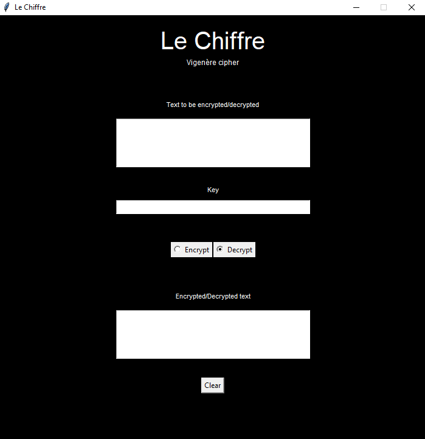
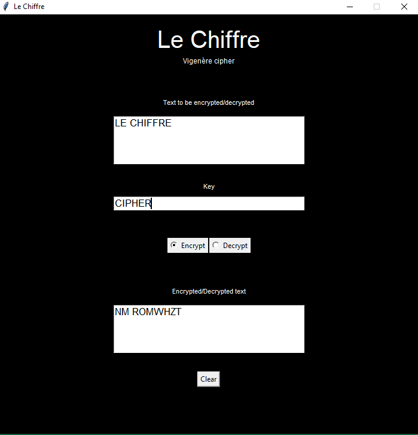
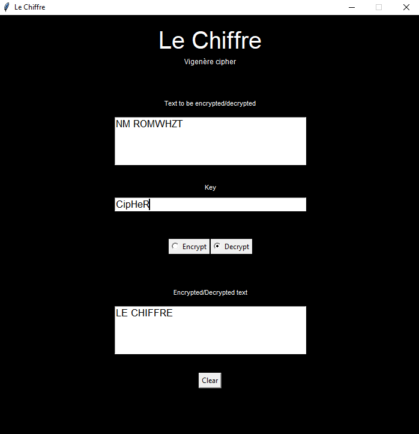

# Le-Chiffre

<h2>Introduction</h2>

Le-Chiffre implements the Vigenère cipher through both a python script as well as a GUI. <a href="https://en.wikipedia.org/wiki/Vigen%C3%A8re_cipher">Vigenère cipher</a> is a simple poly-alphabetic substitution cipher.

<h2>Working</h2>

  <b>GUI interface</b>

<table>
  <tr>
  <td></td>
  <td></td>
  </tr>
  <tr>
  <td>
Encryption
</td>
  <td>
Decryption
</td>
  </tr>
</table>

<h2>License</h2>

<a href="https://github.com/InvincibleJuggernaut/Le-Chiffre/blob/main/LICENSE">MIT License</a>
